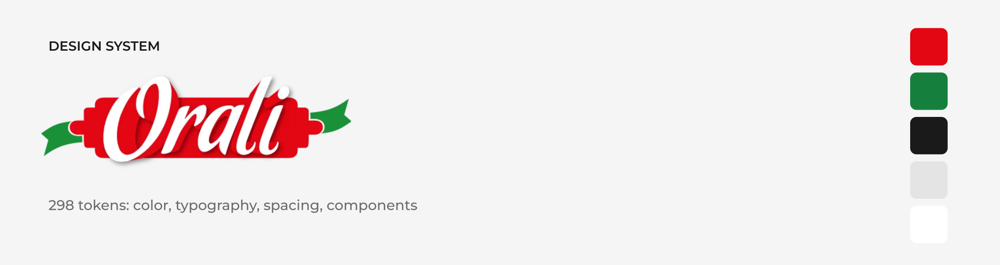

# Orali Design System: Token Infrastructure

Design token pipeline for [Tienda Orali](https://staging.tiendaorali.com), an Argentine artisanal fresh-pasta e-commerce. Tokens are authored once in DTCG format, synced from Figma via Tokens Studio, built with Style Dictionary v4, and consumed by the Next.js + Tailwind site as an npm dependency.

---

## What's in this repo

```
tokens/
  primitive.json        ← raw values: palette, scales, radius, motion
  semantic.json         ← intent: bg, text, border, action, feedback, commerce
  component.json        ← per-component decisions: button, stepper, input, badge, card
  $metadata.json        ← Tokens Studio set order
  $themes.json          ← Tokens Studio theme config
build.mjs               ← Style Dictionary v4 config + custom formats
dist/                   ← generated, committed (consumed via git dependency)
  tokens.css            ← CSS custom properties with references + RGB channels
  tokens.json           ← flat values for JS / tests
  tailwind.preset.js    ← Tailwind preset with semantic utility names
docs/                   ← zeroheight page sources (Color, Typography, Spacing, Tokens, Button, Stepper)
.github/workflows/
  build-tokens.yml      ← rebuilds dist/ when tokens/ changes
```

---

## Token architecture

Three layers, each depending only on the one above it:

```
Primitive   →  color.tomato.600 = #E30613
                 ↓
Semantic    →  color.action.primary.bg = {color.tomato.600}
                 ↓
Component   →  button.add-to-cart.bg = {color.action.primary.bg}
```

Components consume semantic tokens only. The CSS output keeps the reference chain:

```css
--color-tomato-600: #e30613;
--color-action-primary-bg: var(--color-tomato-600);
--button-add-to-cart-bg: var(--color-action-primary-bg);
```

---

## Collections (226 tokens)

| Collection | Tokens | Description |
|---|---|---|
| `color` (primitive) | 29 | tomato, sage, neutral, plus amber/blue for feedback only, alpha |
| `color` (semantic) | 49 | bg, text, border, action, feedback, focus |
| `color.commerce` | 9 | price, discount, dietary badge, free shipping |
| `font` + `typography` | 31 | Montserrat, 4 weights, size and line-height scales, 8 composite styles |
| `space` + `size` + `breakpoint` | 22 | base-4 scale, control heights, container, breakpoints |
| `radius` | 7 | none → full, aligned with Tailwind names |
| `border-width` + `opacity` + `shadow` | 4 | default/focus widths, disabled opacity, sm shadow |
| `duration` + `easing` + `motion` | 8 | 150–1000 ms, standard easing, transitions |
| component | 67 | button (primary, outline, add-to-cart, secondary), stepper, input, badge, card |

---

## Semantic token groups

### Brand & action
| Token | Value | Use |
|---|---|---|
| `color.action.primary.bg` | `tomato.600` (#E30613) | CTAs: Agregar, Ver productos |
| `color.action.primary.bg-hover` | `tomato.700` (#C20510) | Hover on primary actions |
| `color.action.primary.bg-active` | `tomato.800` (#9A040D) | Pressed |
| `color.action.secondary.bg` | `neutral.900` (#1A1A1A) | Dark secondary actions: apply coupon, checkout steps |
| `color.bg.accent` | `sage.700` (#15803D) | Top bar, green surfaces with text |
| `color.focus.ring` | `tomato.600` | 2px focus outline, 2px offset |

### Commerce (e-commerce specific)
| Token | Value | Use |
|---|---|---|
| `color.commerce.price.current` | `neutral.900` | Pack price |
| `color.commerce.price.previous` | `neutral.500` | Strikethrough price |
| `color.commerce.price.unit` | `neutral.500` | "$ 4.200 por unidad" |
| `color.commerce.discount.*` | white / `tomato.600` | "-15%" badge |
| `color.commerce.badge-dietary.*` | `sage.700` / white | Vegano, Sin TACC, Premium |
| `color.commerce.shipping-free.fg` | `sage.700` | "Gratis" in order summary |

### Feedback
| Token | Use |
|---|---|
| `color.feedback.success.*` | Minimum order reached, item added |
| `color.feedback.error.*` | Form validation |
| `color.feedback.warning.*` | Delivery zone notices |
| `color.feedback.info.*` | Informational notes on product pages |

---

## How to use tokens in code

### Install

```bash
npm i github:e-roman/orali-design-tokens
```

### CSS custom properties

```tsx
// app/layout.tsx: import once
import "@orali/design-tokens/tokens.css"
```

```css
.price-unit {
  color: var(--color-commerce-price-unit);
  font: var(--typography-caption);
}
```

### Tailwind

```ts
// tailwind.config.ts
import oraliTokens from "@orali/design-tokens/tailwind"

export default {
  presets: [oraliTokens],
  content: ["./app/**/*.{ts,tsx}", "./components/**/*.{ts,tsx}", "./lib/**/*.{ts,tsx}"],
}
```

```tsx
<button className="h-10 w-full rounded-full bg-action-primary text-on-primary hover:bg-action-primary-hover">
  Agregar
</button>
<span className="text-price-current">$ 12.600</span>
<span className="text-price-unit">$ 4.200 por unidad</span>
```

| Token | Tailwind utility |
|---|---|
| `color.bg.*` | `bg-default`, `bg-subtle`, `bg-muted`, `bg-brand`, `bg-accent`… |
| `color.text.*` | `text-default`, `text-muted`, `text-brand`, `text-accent`… |
| `color.border.*` | `border-default`, `border-strong`, `border-brand`… (also `ring-*`, `divide-*`) |
| `color.action.{role}.bg[-state]` | `bg-action-primary`, `hover:bg-action-primary-hover` |
| `color.action.{role}.fg` | `text-on-primary` |
| `color.feedback.{kind}.*` | `bg-success-subtle`, `bg-success`, `text-error`, `border-warning` |
| `color.commerce.*` | `text-price-current`, `bg-discount`, `bg-badge-dietary`, `text-shipping-free` |
| `radius.*` | `rounded-lg`, `rounded-2xl`, `rounded-full` (replaces Tailwind's scale) |

**Opacity modifiers work.** Every opaque color also ships as RGB channels (`--color-bg-muted-rgb: 228 228 228`), so `bg-muted/70` and `from-scrim/95` compile. With plain `var()` colors, Tailwind 3 drops those classes without a warning. That was happening on the site before the migration: hero and category image gradients never rendered.

Spacing and font sizes follow Tailwind's scale 1:1, so the preset doesn't redefine them.

---

## Sync workflow

```
Figma Variables
      ↕  (Tokens Studio plugin)
GitHub (this repo): tokens/
      ↓  (GitHub Actions on push)
Style Dictionary build
      ↓
dist/tokens.css · dist/tailwind.preset.js · dist/tokens.json
      ↓  (npm update @orali/design-tokens)
Tienda Orali (Next.js + Tailwind)
```

To update tokens:
1. Edit variables in Figma
2. Tokens Studio → Push to GitHub
3. GitHub Actions rebuilds `dist/` and commits it
4. In the site: `npm update @orali/design-tokens`

Local build:

```bash
npm install
npm run build
```

---

## Site migration (tienda-orali)

| Before | After |
|---|---|
| 6 brand colors in `globals.css`, used directly (`text-charcoal`, `bg-tomato`) | Semantic utilities only (`text-default`, `bg-action-primary`) |
| Tailwind's default palette mixed in (`green-600`, `red-50`, `amber-*`, `blue-*`) | Mapped to `feedback.*`, `commerce.*` and brand-tint tokens |
| 12 opacity-modified classes (39 usages) silently dropped | Compiled via RGB channels |
| Hover = `opacity: 0.9` | Hover = `action.primary.bg-hover` |
| 7 border radii, including Tailwind's `md` (6px) | 6 radii, enforced by the preset |
| Add to cart (8px) ≠ quantity stepper (8px), CTAs (pill) | Add to cart + stepper share `radius.full` and height |
| Green text on white at 4.08:1 | `sage.700` at 5.02:1 |

Verified with before/after screenshots across 9 routes × 2 viewports: pixel-identical except for the intended changes.

---

## Accessibility

Color tokens are audited against WCAG 2.1 AA:
- `text.default` on `bg.default`: 17.40:1
- `text.muted` on `bg.default`: 5.33:1, on `bg.subtle`: 4.89:1
- White on `action.primary.bg`: 4.88:1
- White on `action.accent.bg` / `commerce.badge-dietary.bg` (`sage.700`): 5.02:1
- `sage.600` (#1A9139) is kept as a brand color for illustration only: 4.08:1 with white
- Focus: 2px `focus.ring` with 2px offset, `:focus-visible` only
- Touch targets: primary and outline buttons 44px (`size.control.lg`)

---

## Figma file

- **Design System:** [Figma: Orali Ecommerce DS](https://www.figma.com/design/0JYNJACp8FxPdfAT1OgHig)
- **Live site:** [staging.tiendaorali.com](https://staging.tiendaorali.com)

---

## Stack

| Tool | Role |
|---|---|
| Figma + Variables | Single source of truth for design |
| Tokens Studio | Figma ↔ GitHub sync |
| Style Dictionary v4 | DTCG → CSS / JSON / Tailwind preset |
| GitHub Actions | Auto-build pipeline |
| Tailwind CSS 3 | Frontend consumption via preset |
| Next.js 14 / React | Site implementation |
| zeroheight | Documentation |

---

*Emiliano Román, UX/UI Designer & Design Technologist, Buenos Aires, Argentina*
*[emilianoroman.com.ar](https://www.emilianoroman.com.ar)*
